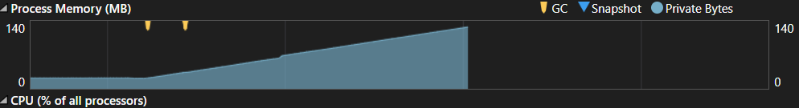
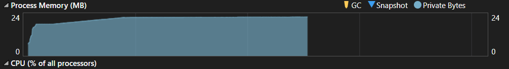

# Memory Optimization

## Overview
The assignment was done to understand how memory is allocated and managed in a C# .NET application.

The MemoryEater file continuously allocates memory. While working with it, observed that how continuous memory allocation can cause high memory usage and eventually lead to an OutOfMemoryException.

Created an optimized version to understand how controlling allocations, cleaning up resources, and managing the lifetime of objects can help avoid these problems.

**Files in the Project**

    MemoryEater.cs – The original version that continuously allocates memory.
    OptimizedMemoryEater.cs – The improved version where memory allocation is controlled and resources are properly handled.
    Program.cs – The main program that allows me to run and compare the two approaches.

## Continuous Memory Allocation
In MemoryEater.cs, memory is allocated inside an infinite loop.

    while (true)
    {
        _memAlloc.Add(new int[10000]);
    }

Since the loop never stops and the allocated arrays remain in the list, the application keeps using more and more memory.

Observed that continuously keeping references to objects can prevent the Garbage Collector from reclaiming that memory.

2. No Proper Stopping Mechanism
The original allocation method runs indefinitely. There was no limit on how many times memory could be allocated.

This also made the program difficult to control from the main program.

3. Resource Cleanup
The original implementation did not have a proper way to clean up the resources used by the object.

## Optimized Memory Allocation:
Controlled Memory Allocation
Instead of allocating memory forever, I added an iterationCount so that the allocation process has a fixed limit.

This makes the program predictable and prevents it from continuously consuming memory.

Clearing Allocated Data
The optimized version periodically clears the list containing the allocated arrays.

This removes the references to those arrays and allows the Garbage Collector to reclaim the memory when appropriate.

Added IDisposable -
Implemented IDisposable in OptimizedMemoryEater.

This gave me a better understanding of how resources can be cleaned up when an object is no longer required.

Added checks to make sure the object has not already been disposed before performing an operation.

### Exploration:
Memory problems are not always caused simply by creating objects. Keeping references to objects for longer than necessary can also prevent the Garbage Collector from freeing them.

- How continuous memory allocation affects an application.
- How a memory leak can happen when references are unnecessarily maintained.
- How the Garbage Collector works at a basic level.
- Why controlling loops and allocations is important.
- How IDisposable and Dispose() are used for cleanup.
- The difference between an intentionally memory-heavy program and an optimized implementation.